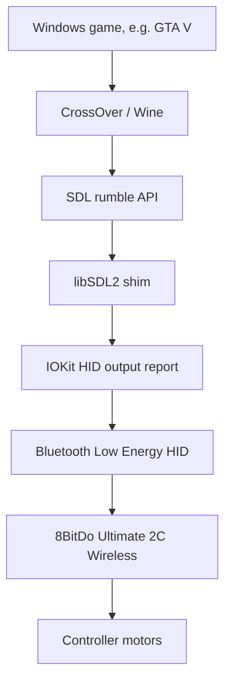

# 8BitDo Ultimate 2C Wireless macOS / CrossOver Rumble Research


> Experimental Bluetooth rumble support for the 8BitDo Ultimate 2C Wireless on macOS when running Windows games through CrossOver.

**Status:** Experimental proof-of-concept • Works on one tested setup • Research project

This project is independent and is not affiliated with or endorsed by 8BitDo, Apple, SDL, Wine, or CodeWeavers. All trademarks belong to their respective owners.

## Can Someone Install This From Scratch?

Not as a simple one-click app.

There are two layers:

1. **CrossOver SDL shim:** included here, builds from source, and can be installed with scripts.
2. **Controller firmware-side rumble path:** required for Bluetooth rumble, but firmware binaries are not included.

A stock controller will not gain Bluetooth rumble from the SDL shim alone. The shim needs the controller firmware to accept the Bluetooth output report described in this repo.

The repo includes scripts to generate the patched firmware locally from an official firmware file:

```sh
./scripts/prepare-patched-firmware.sh
```

It also includes bootloader flash tooling, gated behind an explicit brick-risk environment variable:

```sh
I_UNDERSTAND_BRICK_RISK=1 ./scripts/flash-patched-firmware.sh
```

That means a technical user can reproduce the full setup, but it is still experimental and risky. The repo intentionally does not redistribute official or modified firmware `.dat` files.

## What This Is

This repo packages a local experiment for making an **8BitDo Ultimate 2C Wireless** controller rumble over **Bluetooth** on macOS while running Windows games through **CrossOver**.

The current approach combines:

- a controller firmware research path that enables a Bluetooth HID output report for rumble
- a CrossOver SDL shim that intercepts rumble calls from games
- IOKit HID output reports sent to the paired Bluetooth controller
- GTA V-specific timing and strength tuning

This project modifies application binaries and experimental controller firmware. Use at your own risk.

## Current Status

| Area | Status |
| --- | --- |
| SDL shim builds | Working |
| CrossOver SDL replacement | Working on one tested setup |
| Direct Bluetooth HID output reports | Working with patched controller firmware |
| GTA V rumble calls detected | Working |
| GTA V rumble timing workaround | Working experimentally |
| Automatic install/restore scripts | Included |
| Firmware modification | Required for current Bluetooth path; generated locally, not bundled |
| CrossOver updates | May overwrite the shim |
| Controller coverage | Only tested on one Ultimate 2C Wireless unit |

## Tested Games

| Game | Status | Notes |
| --- | --- | --- |
| GTA V | Tested | Main target. Logs show SDL rumble calls and the shim translates them to Bluetooth output reports. |
| Other CrossOver games | Untested | They may work if they use SDL/XInput rumble through the same CrossOver path. |
| Native macOS games | Untested | This shim targets CrossOver's SDL library, not system-wide native macOS haptics. |

## Features

- Bluetooth rumble path for 8BitDo Ultimate 2C Wireless on macOS
- CrossOver SDL interception
- Direct IOKit HID output reports
- GTA V-tuned rumble curve
- Separate main-motor and trigger-rumble handling
- Minimum-hold workaround for very short GTA pulses
- Logging to inspect real game rumble requests
- Build, install, restore, firmware preparation, and test scripts
- Firmware research notes and patching tools
- No bundled proprietary firmware or CrossOver binaries

## Architecture



The shim writes this Bluetooth HID output report:

```text
report type: Output
report id:   1
payload:     4 bytes [low, high, left, right]
```

More detail: [docs/Architecture.md](docs/Architecture.md)

## Quick Start

Build:

```sh
./scripts/build.sh
```

Install into CrossOver:

```sh
./scripts/install-crossover-shim.sh
```

Restore CrossOver:

```sh
./scripts/restore-crossover-sdl.sh
```

Show the rumble log:

```sh
./scripts/show-log.sh
```

Full setup guide: [docs/Install.md](docs/Install.md)

## Repository Layout

```text
src/sdlshim/
  Current CrossOver SDL shim.

scripts/
  Build, install, restore, firmware preparation, status, and test scripts.

tools/sdl/
  SDL shim tests.

tools/bt-hid/
  Bluetooth HID report experiments.

tools/dongle/
  USB dongle and wired-mode experiments.

tools/firmware/
  Firmware research scripts and bootloader tools.

tools/gamecontroller/
  macOS GameController / haptics experiments.

tools/hidtrace/
  HID tracing/interpose experiments.

docs/
  Install, architecture, firmware, reverse-engineering, and development notes.
```

## What Is Not Included

This repo intentionally excludes:

- CrossOver's original SDL dylib
- built shim dylibs
- official 8BitDo firmware `.dat` files
- modified firmware `.dat` files
- full 8BitDo Ultimate Software app dumps
- Telink SDK checkouts
- local logs, traces, crash reports, or private paths

Reasons: copyright/licensing, file size, privacy, and brick-risk.

## Important Docs

- [Install](docs/Install.md)
- [Architecture](docs/Architecture.md)
- [Firmware](docs/Firmware.md)
- [Reverse Engineering](docs/ReverseEngineering.md)
- [Development](docs/Development.md)
- [Project Status](docs/PROJECT_STATUS.md)
- [Raw Firmware Notes](docs/ULTIMATE2C_FIRMWARE_NOTES.md)
- [Third-party Notices](THIRD_PARTY.md)

## Known Limitations

- Not system-wide; the main integration targets CrossOver's SDL library.
- Requires the controller firmware-side output report path used during testing.
- A stock controller plus shim-only install is not enough for Bluetooth rumble.
- The rumble strength curve is calibrated by feel, not fully decoded motor physics.
- CrossOver bundle replacement is clunky and may be undone by updates.
- Only one Mac/controller combination has been tested.
- Firmware flashing can brick hardware.

## Credits

This work was made possible by the projects, APIs, and tools around:

- SDL2
- Wine
- CrossOver
- macOS IOKit HID
- macOS GameController framework
- 8BitDo firmware research tooling
- Telink firmware research tooling

See [THIRD_PARTY.md](THIRD_PARTY.md) for bundled third-party research helpers.

## License

Original code and documentation in this repository are released under the MIT License. Third-party tools keep their original licenses. See [LICENSE](LICENSE) and [THIRD_PARTY.md](THIRD_PARTY.md).
