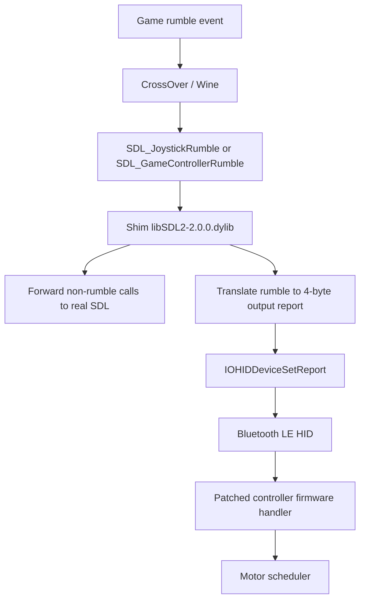

# Architecture

The current approach is an SDL shim plus a firmware-side Bluetooth HID output-report path.



## SDL Shim

The shim replaces CrossOver's `libSDL2-2.0.0.dylib`.

It loads the saved real SDL library:

```text
/Applications/CrossOver.app/Contents/SharedSupport/CrossOver/lib64/libSDL2-2.0.0.8bitdo-real.dylib
```

Most SDL functions are forwarded with `dlopen()` and `dlsym()`.

The shim intercepts rumble-related APIs:

```text
SDL_JoystickRumble
SDL_JoystickRumbleTriggers
SDL_GameControllerRumble
SDL_GameControllerRumbleTriggers
SDL_HapticRumblePlay
SDL_HapticRumbleStop
SDL_HapticRunEffect
SDL_HapticStopEffect
SDL_HapticStopAll
```

It also reports rumble support when SDL asks:

```text
SDL_JoystickHasRumble
SDL_JoystickHasRumbleTriggers
SDL_GameControllerHasRumble
SDL_GameControllerHasRumbleTriggers
SDL_HapticRumbleSupported
SDL_HapticQuery
```

## Bluetooth Device Selection

The shim looks for:

```text
VendorID:            0x2dc8
ProductID:           0x301b
Transport:           Bluetooth Low Energy
MaxOutputReportSize: 5
```

## Output Report

The current output write is:

```c
IOHIDDeviceSetReport(device, kIOHIDReportTypeOutput, 1, payload, 4);
```

Payload:

```text
[low, high, left, right]
```

The firmware-side handler combines normal and trigger-style values with:

```text
low_motor  = max(payload[0], payload[2])
high_motor = max(payload[1], payload[3])
```

## Rumble Curve

The motor response felt non-linear during testing:

```text
20 -> 40 -> 60: noticeable climb
60 -> 80 -> 100: mostly plateau
255: stronger impact bucket
```

So the shim compresses normal game values into the useful physical range and reserves `255` for near-max events.

## GTA Timing Workarounds

GTA/CrossOver frequently sends a nonzero rumble request, a zero trigger request, and then a very fast normal stop.

The shim handles this by:

- tracking normal and trigger rumble separately
- avoiding cancellation from zero trigger-rumble calls
- adding a short minimum physical hold for fast normal stops
- refreshing active packets until their deadline

